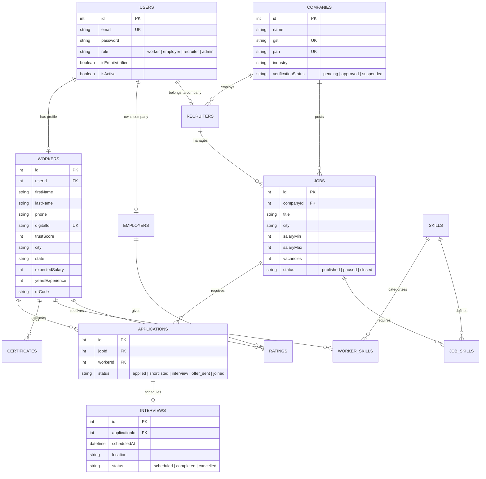
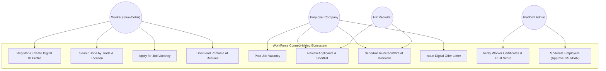
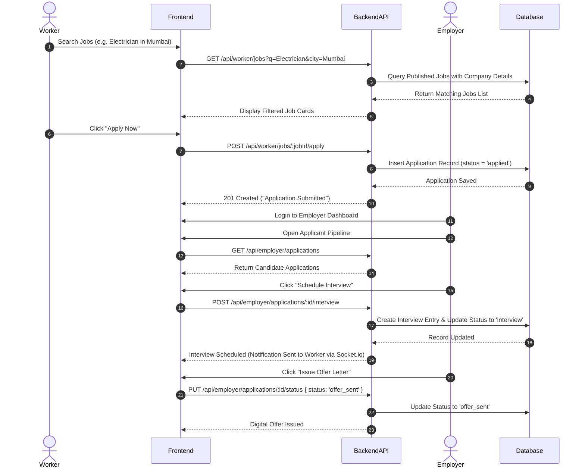

# WorkForce Connect — System Architecture & Diagrams

---

## 1. Entity-Relationship (ER) Diagram (MySQL & Sequelize Schema)

---

## 2. Use Case Diagram

---

## 3. Hiring Flow Sequence Diagram

